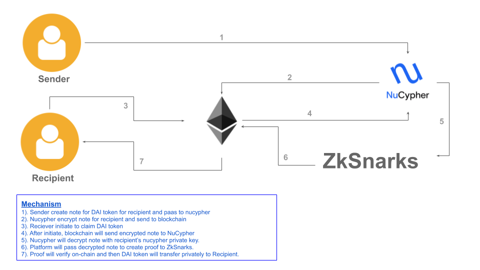
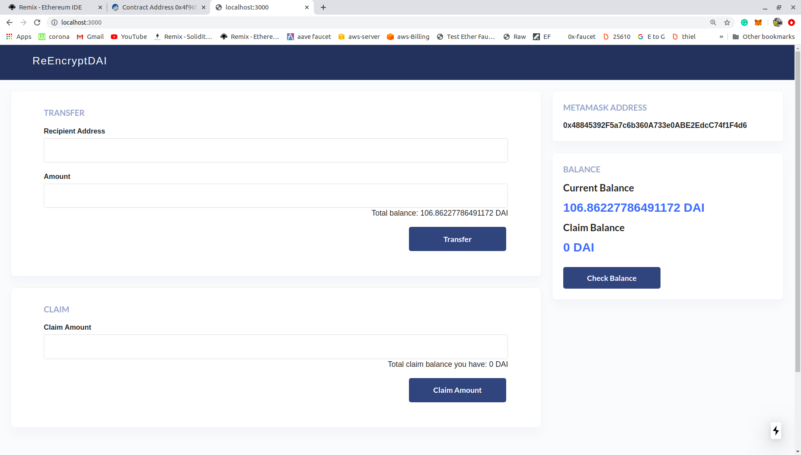
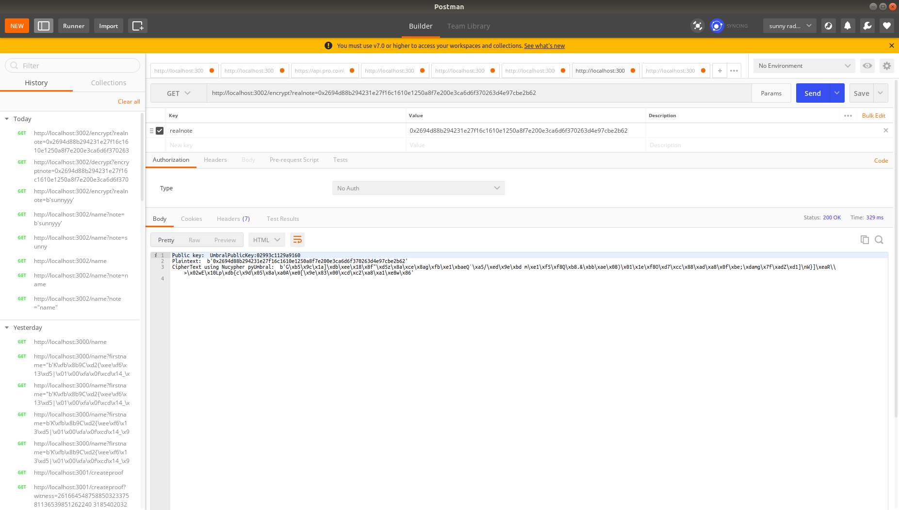
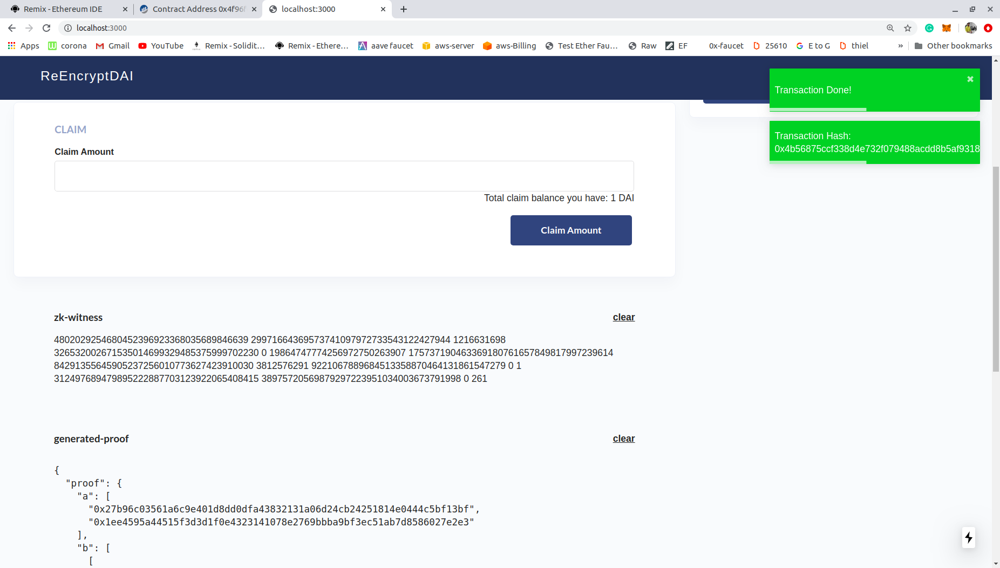
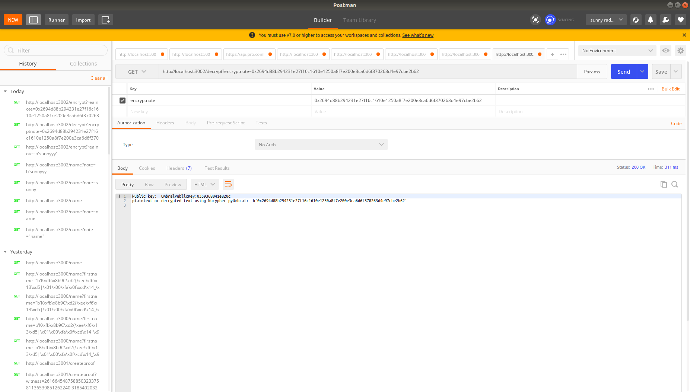
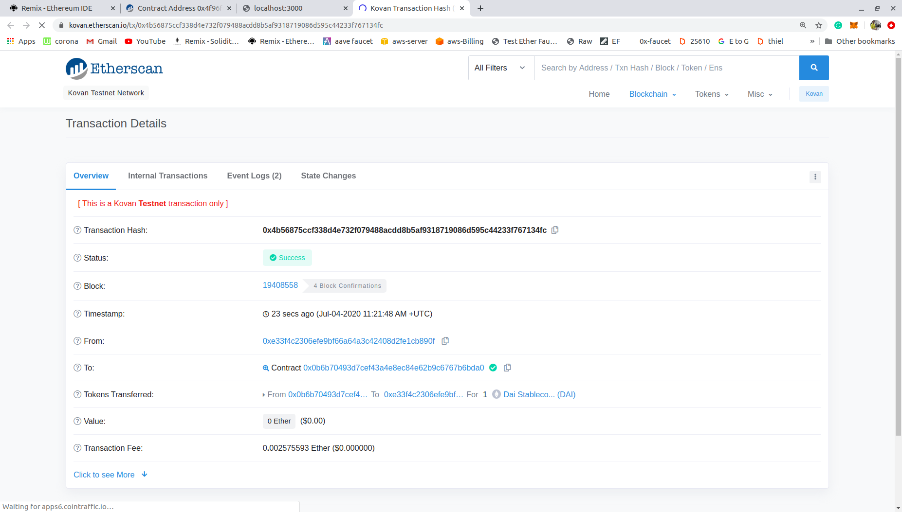

# Developed during Unitize SFBW hackathon

## NuCypher Privacy Wallet

## Nucypher + MakerDao + ZkSNarks

I have created a wallet which consume Nucypher, MakrDao and ZkSNarks Sponsers.

Privacy wallet is a private DAI(MakerDao) wallet transaction using Nucypher-proxy re-encryption model and Zero-Knowledge Proof(ZkSnarks).

Using platform one can transfer makerDao DAI privately to any etherum address. When sender transfer DAI token, platform will create secret note for recipient. Nucypher will encrypt that secret note for recipient and send encrypted secret note to on-chain(ethereum). 
Whenver recipient claim his DAI token at that time ethereum will send encrypted note to nucypher and decrypt using recipient's nucypher private key. If it is decrypted, then Platform pass decrypted secret note to ZkSnarks and ZkSnarks will generate froof for that secret note and it verifies on-chain. And if it is successfully verifies then DAI token will send to recipient privately.

### Diagram


`you can follow diagram-arrows with mechanism point which describe in blue color in the picture or below written Mechanism points. So, you can get better understanding of project`

### Mechanism Points

1). Sender create note for DAI token for recipient and paas to nucypher.  
2). Nucypher encrypt note for recipient and send to on-chain.  
3). Reciever initiate to claim DAI token.  
4). After initiate, blockchain will send encrypted note to NuCypher.  
5). Nucypher will decrypt note with recipient’s nucypher private key.  
6). Platform will pass decrypted note to create proof to ZkSnarks.  
7). Proof will verify on-chain and then DAI token will transfer privately to Recipient.  

### Screenshots Of platform

#### 1. Transfer sender Secreenshot 


#### 2. Encrypt using `Nucypher` Secreenshot


#### 3. Claim recipient and generate proof Secreenshot


#### 4. Decrypt using `Nucypher` Secreenshot


#### 5. Private transactions Secreenshot

```There is no sender address 0x48845392F5a7c6b360A733e0ABE2EdcC74f1F4d6 in etherscan as you can see.```

### How to use for devs?

```note:  You must have Linux system to setup```
- Run Dapp on localhost  
1). clone repo `https://github.com/sunnyRK/nucypher-unitize.git`  
2). `cd nucypher-unitize`  
3). Install dependencies for dapp `npm install`   
4).Run Dapp `node server.js`  
5). Go to `http://localhost:3000`    

- Run Nucypher on node js server  
1). `Same repo`  
2). `cd nucypher-unitize/nucypher`  
3). `node index.js`   
    - It will run on `3002 PORT`.

- Run Zokrates on node js server  
1). `Same repo`  
2). `cd nucypher-unitize/zk-node-api`  
3). `node index.js`   
    - It will run on `3001 PORT`.

### Notes
 - Currently it is on Kovan testnetwork.
 - There are things which needs to handle manually in project. I use cli to do this successfully. My goal is to make automate it. So still need to work around this. I am constantly working on this.

### Contacts

`radadiyasunny970@gmail.com`  
[Twitter](https://twitter.com//RadadiyaSunny)


